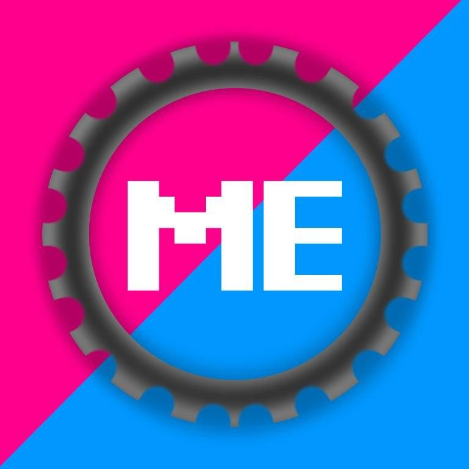
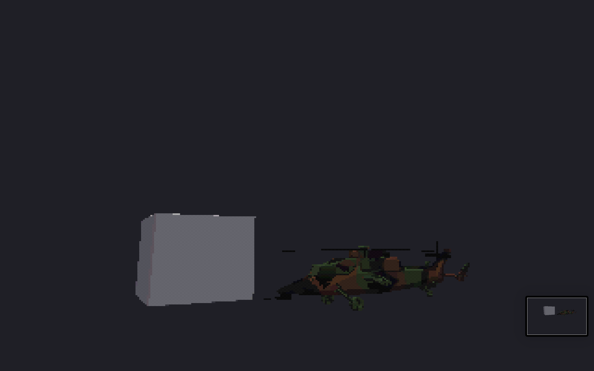

<div align="center">

# 

# MioEngine

### 3D игровой движок в стиле PlayStation 1

[](https://luajit.org/)
[](https://www.opengl.org/)
[](LICENSE)

---

**Софтварный рендеринг через OpenGL 3.3 • Низкополигоные модели • Пиксельные текстуры • Vertex snapping • Кастомный язык скриптинга MioLang**

</div>

---

## Что это?

**MioEngine** — это 3D игровой движок, стилизованный под игры эпохи **PlayStation 1** (1994-2000). Движок использует LuaJIT FFI для прямого вызова OpenGL 3.3, GLFW, Assimp и OpenAL без C-модулей и CMake.



### Ключевые особенности

| Особенность | Описание |
|---|---|
| **PS1 эстетика** | Низкополигоные модели, пиксельные текстуры, 5-битный цвет с дитерингом, vertex snapping, экспоненциальный туман |
| **Рендеринг** | Внутренний FBO с низким разрешением (320x240 по умолчанию), масштабирование через `GL_NEAREST` для пиксельного эффекта |
| **MioLang** | Свой скриптовый язык с лексером, парсером и исполнителем для создания игр без написания кода на Lua |
| **Физика** | 2D и 3D физика с коллизиями, гравитацией, прыжками и толчками |
| **Частицы** | 2D и 3D генератор частиц с настройкой формы, цвета, скорости и жизни |
| **Анимация** | Sprite-анимации с настройкой кадров, FPS и зацикливания |
| **GUI** | Текстовый рендерер (stb_truetype), панели, кнопки, чекбоксы, слайдеры, лейблы |
| **Кастомные шейдеры** | Вершинные и фрагментные шейдеры с hot-reload через менеджер шейдеров |
| **Аудио** | Поддержка WAV звуков через OpenAL |
| **Импорт моделей** | Загрузка FBX, OBJ, GLTF, DAE, Blend, STL, PLY и др. через Assimp с авто-нормализацией размера |

---

## Быстрый старт

### Зависимости

| Инструмент | Зачем | Установка |
|---|---|---|
| **LuaJIT** | Интерпретатор Lua с FFI | `brew install luajit` (macOS) / [luajit.org](http://luajit.org/download.html) (Windows) |
| **GLFW** | Окна и ввод | `brew install glfw` (macOS) / [glfw.org](https://www.glfw.org/download.html) (Windows) |
| **Assimp** | Импорт 3D моделей | `brew install assimp` (macOS) / [github.com/assimp/assimp/releases](https://github.com/assimp/assimp/releases) (Windows) |
| **OpenAL** | Аудио (WAV звуки) | Встроен в macOS / `brew install openal-soft` (Linux) / [openal-soft.org](https://openal-soft.org/) (Windows) |
| **stb_image** | Загрузка текстур | Собирается из `deps/build.sh` (или `build.bat` на Windows) |
| **stb_truetype** | Текстовый рендерер | Собирается из `deps/build.sh` (или `build.bat` на Windows) |

### Установка и запуск

#### macOS / Linux

```bash
git clone https://github.com/DOOLIVING/mioengine.git
cd alone
cd deps && bash build.sh && cd ..
luajit main.lua
```

#### Windows (пошагово)

**1. Скачайте и установите LuaJIT**

Скачайте с http://luajit.org/download.html — файл `luajit-2.1.x.x-win32.zip` или `luajit-2.1.x.x-win64.zip`.
Распакуйте, добавьте папку с `luajit.exe` в `PATH` Windows (чтобы работала команда `luajit` из любой папки).

**2. Скачайте GLFW**

Скачайте с https://www.glfw.org/download.html — готовый релиз `glfw-X.X.X.bin.WINXX.zip`.
Внутри будут файлы:
- `lib-vc20XX/glfw3.dll` (или `glfw3.lib`)
- `bin-vc20XX/glfw3.dll`

Положите `glfw3.dll` в папку `deps/` проекта.

**3. Скачайте Assimp**

Скачайте с https://github.com/assimp/assimp/releases — файл `assimp-X.X.X-win32.zip` или `win64.zip`.
Положите `assimp.dll` в папку `deps/` проекта.

**4. Скачайте OpenAL Soft**

Скачайте с https://openal-soft.org/openal-binaries/ — файл `openal-soft-*-bin.zip`.
Положите `OpenAL32.dll` в папку `deps/` проекта.

**5. Соберите stb библиотеки**

Для этого нужен MinGW (`gcc`) или Visual Studio (`cl`).
- Скачайте MinGW с https://www.mingw-w64.org/ или используйте `winget install MSYS2.MSYS2`, затем `pacman -S mingw-w64-x86_64-gcc`
- Откройте терминал в папке `deps/` и запустите:
```
build.bat
```
- Убедитесь, что файлы `stb_image.dll` и `stb_truetype.dll` появились в папке `deps/`

**Итого — структура папки `deps/` должна выглядеть так:**

```
deps/
├── glfw3.dll
├── assimp.dll
├── OpenAL32.dll
├── stb_image.dll       (собранный)
├── stb_truetype.dll    (собранный)
├── stb_image.h
├── stb_truetype.h
├── stb_image_impl.c
├── stb_truetype_impl.c
├── build.sh
└── build.bat
```

**6. Запустите**

```
luajit main.lua
```

Если LuaJIT выдаёт ошибку `not found` на какую-то DLL — значит она не лежит в `deps/` или не добавлена в `PATH`.

---

**Решение проблем:**

| Проблема | Решение |
|---|---|
| `cannot find -lglfw` | Положите `glfw3.dll` в `deps/` |
| `stb_image.dll not found` | Запустите `build.bat` в папке `deps/` |
| `luajit не найден` | Добавьте папку с `luajit.exe` в PATH Windows |
| Чёрный экран | Убедитесь, что OpenGL 3.3 поддерживается вашей видеокартой |

---

## Структура проекта

```
alone/
├── main.lua              # Точка входа (2 строки: require + engine.run)
├── mioengine_cli.py      # CLI менеджер проектов
│
├── engine/               # Движок
│   ├── main.lua          # Основной цикл, контекст сцен, инициализация
│   ├── core/
│   │   ├── camera.lua    # FPS камера (WASD + мышь)
│   │   ├── input.lua     # Ввод (клавиатура, мышь, скролл)
│   │   ├── math.lua      # 3D математика (vec3, mat4, quaternion)
│   │   ├── ui.lua        # 2D UI система (rect, circle, line, текст, виджеты)
│   │   ├── resource_manager.lua  # Кэш моделей и текстур
│   │   ├── conf_parser.lua       # Парсер .mioconf файлов
│   │   ├── platform/
│   │   │   ├── gl.lua     # OpenGL 3.3 FFI загрузчик
│   │   │   ├── glfw.lua   # GLFW FFI обертка
│   │   │   ├── platform.lua # Кросс-платформенное определение ОС и загрузка библиотек
│   │   │   └── audio.lua  # OpenAL WAV аудио
│   │   ├── render/
│   │   │   ├── renderer.lua     # PS1 рендерер (FBO, шейдеры)
│   │   │   ├── mesh.lua         # Загрузка мешей через Assimp + GPU
│   │   │   ├── shader.lua       # Компиляция и управление шейдерами
│   │   │   ├── shader_manager.lua # Кэш шейдеров с hot-reload
│   │   │   ├── texture.lua      # Загрузка текстур через stb_image
│   │   │   ├── font.lua         # Текстовый рендерер через stb_truetype
│   │   │   └── assimp.lua       # Assimp FFI обертка
│   │   └── scene/
│   │       ├── scene_graph.lua  # Граф сцены с иерархическими трансформами
│   │       ├── scene_manager.lua # Переключение сцен
│   │       └── mio_object.lua   # Объект MioLang (позиция, вращение, скейл)
│   └── lang/
│       ├── mio_lang.lua   # Рантайм MioLang (загрузка, события, import)
│       ├── lexer.lua       # Лексический анализатор
│       ├── parser.lua      # Рекурсивный спуск (2077 строк)
│       ├── evaluator.lua   # Вычисление выражений
│       └── executor.lua    # Исполнитель команд
│
├── game/                 # Игровой контент
│   ├── main.mioconf      # Конфигурация движка
│   ├── scripts/
│   │   ├── demo.mio      # Демо сцена (вертолёт + куб)
│   │   ├── menu.mio      # Главное меню
│   │   └── objects/
│   │       ├── cube.mio        # Заглушка объекта куба
│   │       └── helicopter.mio  # Заглушка объекта вертолёта
│   ├── shaders/          # Кастомные шейдеры
│   │   ├── default.vert  # Вершинный шейдер по умолчанию
│   │   ├── default.frag  # Фрагментный шейдер (Phong + туман)
│   │   ├── wave.vert     # Синусоидальная волна
│   │   ├── wave2.vert    # Волна по XZ
│   │   ├── pulse.frag    # Пульсирующая яркость
│   │   └── fresnel.frag  # Fresnel свечение по краям
│   └── models/           # 3D модели и текстуры
│       ├── helicopter.fbx
│       └── helicopter.png
│
├── deps/                 # Нативные зависимости
│   ├── stb_image.h       # stb_image (заголовок)
│   ├── stb_image_impl.c  # Юнит компиляции
│   ├── libstb_image.dylib # Собранный .dylib
│   ├── stb_truetype.h    # stb_truetype (заголовок)
│   ├── stb_truetype_impl.c # Юнит компиляции
│   ├── libstb_truetype.dylib # Собранный .dylib
│   ├── build.sh          # Скрипт сборки (macOS/Linux)
│   └── build.bat         # Скрипт сборки (Windows)
│
├── vscode-mio/           # Расширение VSCode
├── Cube.fbx              # Тестовая модель куба
├── logo.jpg              # Лого проекта
└── screen1.png           # Скриншот
```

---

## Язык MioLang

**MioLang** — простой скриптовый язык для создания игр. Синтаксис вдохновлен BASIC и простыми языками 90-х.

### Комментарии

```
// Это комментарий
let x = 10  // Комментарий к строке
```

### Переменные

```
let health = 100
let name = "player"
let coins = []
let speed = 0.5
```

### Типы данных

| Тип | Пример | Описание |
|---|---|---|
| Число | `42`, `3.14`, `-10` | Целые и дробные |
| Строка | `"hello"`, `'world'` | Текст |
| Булево | `true`, `false` | Логический |
| Массив | `[1, 2, 3]` | Коллекция |
| Nil | `nil` | Пустое значение |

### Операторы

```
// Арифметические
let a = 10 + 5
let b = 20 - 3
let c = 4 * 2
let d = 16 / 4
let e = 10 % 3

// Присваивание с операцией
let x = 0
x += 10    // x = x + 10
x -= 5     // x = x - 5
x *= 2     // x = x * 2
x /= 4     // x = x / 4

// Сравнение
if x == 10 then ... end
if x ~= 5 then ... end
if x > 0 then ... end
if x <= 100 then ... end

// Логические
if a and b then ... end
if a or b then ... end
if not a then ... end
```

### Условия

```
if health > 50 then
    say "Полно HP"
else
    if health > 20 then
        say "Среднее HP"
    else
        say "Мало HP"
    end
end
```

### Циклы

```
// Цикл for
for i = 0 to 10
    say "" + i
end

// Цикл с шагом
for i = 0 to 100 step 5
    say "Step: " + i
end

// Бесконечный цикл
loop forever
    // код
end

// Break
for i = 0 to 100
    if i > 10 then
        break
    end
end
```

### События

```
on_update
    // Вызывается каждый кадр (60 FPS)
    camera_update
end

on_draw
    // Рисование поверх 3D сцены (2D HUD)
    draw_text "HP: 100", 10, 10, 12, 1, 1, 1, 1, left
end

on_key "e"
    // Нажатие клавиши E
    say "Нажата E"
end

on_key "escape"
    switch_scene "menu"
end

on_mouse
    // Обработка мыши
end

on_click objName
    // Клик по объекту
end

on_collision obj1, obj2
    // Столкновение объектов
end
```

---

## Команды MioLang

### Настройка движка

| Команда | Описание | Пример |
|---|---|---|
| `setup_camera x, y, z` | Установить позицию камеры | `setup_camera 0, 2.5, 8` |
| `setup_camera ... speed N` | Скорость камеры | `setup_camera 0, 2.5, 8 speed 5` |
| `setup_camera ... sensitivity N` | Чувствительность мыши (умножается на 0.001) | `setup_camera 0, 2.5, 8 sensitivity 2` |
| `setup_renderer w, h` | Размер рендербуфера (PS1 разрешение) | `setup_renderer 320, 240` |
| `setup_renderer ... fov N` | Поле зрения (в градусах) | `setup_renderer 320, 240 fov 55` |
| `set_mouse relative` | Скрыть и захватить курсор | `set_mouse relative` |
| `set_mouse visible` | Показать курсор | `set_mouse visible` |
| `exit_game` | Выйти из игры | `exit_game` |

### Работа с объектами

| Команда | Описание | Пример |
|---|---|---|
| `add_object name from "file" at x, y, z` | Загрузить и добавить 3D объект | `add_object cube from "Cube.fbx" at 0, 1, 0` |
| `create_model name from "file" at x, y, z` | То же, с возвратом ссылки | `let obj = create_model from "Cube.fbx" at 0, 1, 0` |
| `add_object ... scale N` | Масштаб объекта | `add_object cube from "Cube.fbx" at 0, 0, 0 scale 2` |
| `add_object ... rotatex N` | Скорость вращения по X | `add_object cube from "Cube.fbx" at 0, 1, 0 rotatex 0.5` |
| `add_object ... rotatey N` | Скорость вращения по Y | `add_object cube from "Cube.fbx" at 0, 1, 0 rotatey 0.3` |
| `add_object ... size N` | Размер (для UI) | `add_object btn from "button.fbx" at 100, 50, 0 size 32` |
| `add_object ... draworder N` | Порядок отрисовки | `add_object floor from "floor.fbx" at 0, 0, 0 draworder 0` |
| `move obj by dx, dy, dz` | Двинуть объект | `move player by 0, 0, 1` |
| `move obj towards target speed N` | Двигать к цели со скоростью | `move enemy towards player speed 2` |
| `set_pos obj to x, y, z` | Установить позицию | `set_pos player to 0, 1, 0` |
| `get_pos obj => x, y, z` | Получить позицию в переменные | `get_pos player => px, py, pz` |
| `set_rot obj axis value` | Установить скорость вращения (axis: x, y, angle_x, angle_y) | `set_rot cube y 0.5` |
| `set_scale obj value` | Установить масштаб | `set_scale cube 2` |
| `destroy obj` | Удалить объект | `destroy cube` |

### Текстуры

| Команда | Описание | Пример |
|---|---|---|
| `load_texture "name", "path"` | Загрузить текстуру | `load_texture "heli_tex", "game/models/helicopter.png"` |
| `set_texture obj, "name"` | Назначить текстуру объекту | `set_texture helicopter, "heli_tex"` |

### Шейдеры

| Команда | Описание | Пример |
|---|---|---|
| `load_shader "name", "vert", "frag"` | Загрузить и скомпилировать шейдер | `load_shader "wave", "shaders/wave.vert", "shaders/pulse.frag"` |
| `set_shader obj, "name"` | Назначить шейдер объекту | `set_shader cube, "wave"` |
| `set_shader_uniform obj, "name", value` | Установить uniform (float) | `set_shader_uniform cube, "uTime", time()` |
| `set_shader_uniform obj, "name", r, g, b` | Установить uniform (vec3) | `set_shader_uniform cube, "uColor", 1, 0, 0` |
| `reload_shader "name"` | Перезагрузить шейдер с диска | `reload_shader "wave"` |

### 2D UI (HUD)

| Команда | Описание | Пример |
|---|---|---|
| `draw_text "text", x, y, size, r, g, b, a, align` | Нарисовать текст | `draw_text "Score: 100", 10, 10, 12, 1, 1, 1, 1, left` |
| `draw_rect x, y, w, h, r, g, b` | Нарисовать прямоугольник | `draw_rect 0, 200, 320, 40, 0.1, 0.1, 0.1` |
| `draw_circle x, y, radius, r, g, b` | Нарисовать круг | `draw_circle 160, 120, 5, 1, 1, 1` |
| `draw_line x1, y1, x2, y2, r, g, b, a, width` | Нарисовать линию | `draw_line 0, 200, 320, 200, 0.5, 0.5, 0.5, 1, 1` |
| `draw_image "path", x, y` | Нарисовать изображение | `draw_image "ui/icon.png", 10, 10` |
| `get_canvas_size => w, h` | Получить размер рендербуфера | `get_canvas_size => w, h` |

**Примечание:** `draw_text` выводит текст на экран с использованием TTF-шрифтов через stb_truetype.

### Звуки

| Команда | Описание | Пример |
|---|---|---|
| `play_sound name from "file.wav"` | Воспроизвести WAV звук | `play_sound jump from "sounds/jump.wav"` |
| `play_sound name from "file.wav" loop` | Зациклить звук | `play_sound music from "sounds/music.wav" loop` |
| `stop_sound` | Остановить все звуки | `stop_sound` |
| `mute` | Включить/выключить звук | `mute` |
| `volume N` | Установить громкость (0.0 - 1.0) | `volume 0.5` |

### Импорт

```
import("game/scripts/coins.mio")
import("game/scripts/enemies.mio")
```

Импортируемый скрипт разделяет область видимости переменных с основным скриптом.

### Математика

| Функция | Описание | Пример |
|---|---|---|
| `sin(x)` | Синус | `let y = sin(3.14)` |
| `cos(x)` | Косинус | `let y = cos(0)` |
| `atan2(y, x)` | Арктангенс | `let a = atan2(dy, dx)` |
| `sqrt(x)` | Квадратный корень | `let s = sqrt(16)` |
| `abs(x)` | Модуль | `let a = abs(-5)` |
| `floor(x)` | Округление вниз | `let f = floor(3.7)` |
| `ceil(x)` | Округление вверх | `let c = ceil(3.2)` |
| `min(a, b)` | Минимум | `let m = min(10, 5)` |
| `max(a, b)` | Максимум | `let m = max(10, 5)` |
| `random(n)` | Случайное число 0..n | `let r = random(100)` |
| `random(a, b)` | Случайное число a..b | `let r = random(1, 6)` |
| `dist(x1,y1,z1, x2,y2,z2)` | Расстояние | `let d = dist(0,0,0, 1,1,1)` |
| `pi()` | Число Pi | `let p = pi()` |
| `time()` | Время в секундах | `let t = time()` |
| `type(x)` | Тип переменной | `let t = type(x)` |
| `tostring(x)` | В строку | `let s = tostring(42)` |
| `tonumber(x)` | В число | `let n = tonumber("42")` |
| `str(...)` | Конкатенация | `let s = str("HP: ", health)` |
| `print(...)` | Вывод в консоль (аналог `say`) | `print("Hello")` |

### Выражения для проверки состояния

| Выражение | Описание | Пример |
|---|---|---|
| `key_down "key"` | Клавиша удерживается | `if key_down "w" then move player by 0, 0, -0.1 end` |
| `mouse_down btn` | Кнопка мыши удерживается (0=ЛКМ, 1=ПКМ, 2=СКМ) | `if mouse_down 0 then say "clicked" end` |
| `action_down "action"` | Действие удерживается (через bind_key) | `if action_down "jump" then ... end` |
| `action_pressed "action"` | Действие нажато в этом кадре | `if action_pressed "fire" then ... end` |
| `action_released "action"` | Действие отпущено в этом кадре | `if action_released "fire" then ... end` |

### Физика (2D)

| Команда | Описание | Пример |
|---|---|---|
| `add_body id, x, y, ...` | Создать физическое тело | `add_body "p1", 100, 200, w=32, h=32, mass=1` |
| `set_physics obj, mode, ...` | Привязать физику к объекту | `set_physics player, dynamic, w=32, h=32` |
| `set_gravity gx, gy` | Установить гравитацию | `set_gravity 0, 980` |
| `set_physics_gravity g` | Установить гравитацию (2D) | `set_physics_gravity 980` |
| `set_physics_ground y` | Установить уровень пола | `set_physics_ground 600` |
| `physics_update` | Обновить физику | `physics_update` |
| `body_apply_force id, fx, fy` | Применить силу | `body_apply_force "p1", 0, -500` |
| `body_apply_impulse id, ix, iy` | Применить импульс | `body_apply_impulse "p1", 0, -10` |
| `set_body_vel id, vx, vy` | Установить скорость | `set_body_vel "p1", 5, 0` |
| `get_body_vel id => vx, vy` | Получить скорость | `get_body_vel "p1" => vx, vy` |
| `set_body_pos id, x, y` | Установить позицию тела | `set_body_pos "p1", 100, 200` |
| `get_body_pos id => x, y` | Получить позицию тела | `get_body_pos "p1" => x, y` |
| `remove_body id` | Удалить тело | `remove_body "p1"` |
| `is_grounded id` | Проверить, на земле ли тело | `if is_grounded "p1" then ... end` |
| `body_colliding id, tag` | Проверить столкновение по тегу | `if body_colliding "p1", "enemy" then ... end` |
| `obj_impulse obj, ix, iy` | Импульс объекту | `obj_impulse player, 0, -10` |
| `obj_set_vel obj, vx, vy` | Скорость объекту | `obj_set_vel player, 5, 0` |
| `obj_set_pos obj, x, y` | Позиция объекту | `obj_set_pos player, 100, 200` |
| `obj_is_grounded obj` | На земле ли объект | `if obj_is_grounded player then ... end` |
| `obj_colliding obj, tag` | Столкновение объекта по тегу | `if obj_colliding player, "wall" then ... end` |

### Физика (3D)

| Команда | Описание | Пример |
|---|---|---|
| `add_body3d id, x, y, z, ...` | Создать 3D физическое тело | `add_body3d "b1", 0, 5, 0, radius=0.5` |
| `set_physics3d obj, mode, ...` | Привязать 3D физику к объекту | `set_physics3d ball, dynamic, radius=0.5` |
| `set_physics3d_gravity gx, gy, gz` | 3D гравитация | `set_physics3d_gravity 0, -9.8, 0` |
| `set_physics3d_floor y` | Уровень пола (3D) | `set_physics3d_floor 0` |
| `physics3d_update` | Обновить 3D физику | `physics3d_update` |
| `body3d_apply_force id, fx, fy, fz` | 3D сила | `body3d_apply_force "b1", 0, 10, 0` |
| `body3d_apply_impulse id, ix, iy, iz` | 3D импульс | `body3d_apply_impulse "b1", 0, 5, 0` |
| `set_body3d_vel id, vx, vy, vz` | 3D скорость | `set_body3d_vel "b1", 1, 0, 0` |
| `get_body3d_vel id => vx, vy, vz` | Получить 3D скорость | `get_body3d_vel "b1" => vx, vy, vz` |
| `set_body3d_pos id, x, y, z` | 3D позиция тела | `set_body3d_pos "b1", 0, 1, 0` |
| `get_body3d_pos id => x, y, z` | Получить 3D позицию тела | `get_body3d_pos "b1" => x, y, z` |
| `remove_body3d id` | Удалить 3D тело | `remove_body3d "b1"` |
| `obj3d_impulse obj, ix, iy, iz` | 3D импульс объекту | `obj3d_impulse ball, 0, 5, 0` |
| `obj3d_set_vel obj, vx, vy, vz` | 3D скорость объекту | `obj3d_set_vel ball, 1, 0, 0` |
| `obj3d_get_vel obj => vx, vy, vz` | Получить 3D скорость объекта | `obj3d_get_vel ball => vx, vy, vz` |
| `obj3d_set_pos obj, x, y, z` | 3D позиция объекту | `obj3d_set_pos ball, 0, 1, 0` |
| `obj3d_is_grounded obj` | 3D объект на земле | `if obj3d_is_grounded ball then ... end` |
| `obj3d_colliding obj, tag` | 3D столкновение по тегу | `if obj3d_colliding ball, "wall" then ... end` |

### Частицы (2D)

| Команда | Описание | Пример |
|---|---|---|
| `create_particles name, ...` | Создать систему частиц | `create_particles sparks, x=160, y=120, r=1, g=0.8, b=0` |
| `particles_set_pos name, x, y` | Переместить систему | `particles_set_pos sparks, 100, 200` |
| `particles_emit name, count` | Выбросить частицы | `particles_emit sparks, 5` |
| `particles_burst name, count` | Взрыв частиц | `particles_burst sparks, 50` |
| `particles_start name` | Запустить непрерывный выброс | `particles_start sparks` |
| `particles_stop name` | Остановить выброс | `particles_stop sparks` |
| `particles_clear name` | Удалить все частицы | `particles_clear sparks` |
| `particles_configure name, ...` | Настроить параметры | `particles_configure sparks, gravity=200` |
| `draw_particles name` | Отрисовать частицы | `draw_particles sparks` |

### Частицы (3D)

| Команда | Описание | Пример |
|---|---|---|
| `create_particles3d name, ...` | Создать 3D систему частиц | `create_particles3d fx, x=0, y=1, z=0` |
| `particles3d_set_pos name, x, y, z` | Переместить 3D систему | `particles3d_set_pos fx, 0, 2, 0` |
| `particles3d_emit name, count` | Выбросить 3D частицы | `particles3d_emit fx, 10` |
| `particles3d_burst name, count` | Взрыв 3D частиц | `particles3d_burst fx, 100` |
| `particles3d_start name` | Запустить непрерывный выброс | `particles3d_start fx` |
| `particles3d_stop name` | Остановить выброс | `particles3d_stop fx` |
| `particles3d_clear name` | Удалить все 3D частицы | `particles3d_clear fx` |
| `particles3d_configure name, ...` | Настроить параметры | `particles3d_configure fx, gravity=9.8` |
| `draw_particles3d name` | Отрисовать 3D частицы | `draw_particles3d fx` |

### Анимация

| Команда | Описание | Пример |
|---|---|---|
| `create_anim name, [frames], ...` | Создать анимацию | `create_anim walk, [0,1,2,3], fps=8, loop=true` |
| `create_animated_sprite name, "image", ...` | Создать анимированный спрайт | `create_animated_sprite hero, "hero.png"` |
| `anim_add sprite, "name", [frames], ...` | Добавить анимацию спрайту | `anim_add hero, "idle", [0,1], fps=4` |
| `anim_play sprite, "name"` | Воспроизвести анимацию | `anim_play hero, "walk"` |
| `anim_stop sprite` | Остановить анимацию | `anim_stop hero` |
| `anim_pause sprite` | Пауза анимации | `anim_pause hero` |
| `anim_resume sprite` | Продолжить анимацию | `anim_resume hero` |
| `anim_set_speed sprite, fps` | Изменить скорость | `anim_set_speed hero, 12` |
| `anim_set_frame sprite, frame` | Установить кадр | `anim_set_frame hero, 1` |
| `draw_animated_sprite name` | Отрисовать спрайт | `draw_animated_sprite hero` |

### GUI панели

| Команда | Описание | Пример |
|---|---|---|
| `create_panel name, ...` | Создать панель | `create_panel menu, x=10, y=10, w=300, h=400` |
| `panel_add_button panel, "label", ...` | Добавить кнопку | `panel_add_button menu, "Start", id="btn_start"` |
| `panel_add_label panel, "text", ...` | Добавить лейбл | `panel_add_label menu, "Score: 0"` |
| `panel_add_separator panel` | Добавить разделитель | `panel_add_separator menu` |
| `draw_panel panel` | Отрисовать панель | `draw_panel menu` |
| `panel_set_visible panel, bool` | Показать/скрыть панель | `panel_set_visible menu, true` |
| `panel_set_pos panel, x, y` | Переместить панель | `panel_set_pos menu, 50, 50` |

### UI виджеты

| Команда | Описание | Пример |
|---|---|---|
| `ui_button x, y, w, h, "label", ...` | Кнопка | `ui_button 10, 10, 100, 30, "Play"` |
| `ui_checkbox x, y, size, checked, ...` | Чекбокс | `ui_checkbox 10, 50, 20, true` |
| `ui_slider x, y, w, h, value, min, max, ...` | Слайдер | `ui_slider 10, 80, 200, 20, 50, 0, 100` |
| `ui_label x, y, "text", ...` | Лейбл | `ui_label 10, 110, "Volume"` |
| `ui_visible id` | Показать элемент | `ui_visible "btn_start"` |
| `ui_hidden id` | Скрыть элемент | `ui_hidden "btn_start"` |
| `ui_clear` | Очистить все UI элементы | `ui_clear` |
| `ui_clicked id` | Проверить клик по кнопке (выражение) | `if ui_clicked "btn_start" then ... end` |
| `ui_checked id` | Проверить состояние чекбокса (выражение) | `if ui_checked "chk1" then ... end` |
| `ui_slider_value id` | Значение слайдера (выражение) | `let vol = ui_slider_value "sld1"` |

### Привязка клавиш

| Команда | Описание | Пример |
|---|---|---|
| `bind_key "action", "key1", "key2", ...` | Привязать клавиши к действию | `bind_key "jump", "space", "w"` |
| `unbind_key "action"` | Убрать привязку | `unbind_key "jump"` |
| `load_default_bindings` | Загрузить привязки по умолчанию | `load_default_bindings` |

### 2D камера

| Команда | Описание | Пример |
|---|---|---|
| `setup_camera2d x, y, ...` | Настроить 2D камеру | `setup_camera2d 0, 0, zoom=1` |
| `move_camera2d dx, dy` | Двинуть 2D камеру | `move_camera2d 1, 0` |
| `set_camera2d_pos x, y` | Установить позицию 2D камеры | `set_camera2d_pos 0, 0` |
| `zoom_camera2d amount` | Зум 2D камеры | `zoom_camera2d 0.1` |
| `draw_sprite "path", x, y, ...` | Нарисовать спрайт (2D) | `draw_sprite "hero.png", 100, 200` |

### Отладка

| Команда | Описание | Пример |
|---|---|---|
| `say "text"` | Вывод в консоль | `say "Hello World"` |
| `switch_scene "name"` | Переключить сцену | `switch_scene "menu"` |
| `toggle_console` | Включить/выключить отладочную консоль | `toggle_console` |
| `console_log msg` | Лог в отладочную консоль | `console_log "debug info"` |
| `profiler_start "name"` | Начать замер производительности | `profiler_start "update"` |
| `profiler_end "name"` | Завершить замер | `profiler_end "update"` |
| `profiler_reset` | Сбросить профилировщик | `profiler_reset` |
| `watch_file "path"` | Следить за файлом (hot-reload) | `watch_file "shaders/wave.frag"` |
| `unwatch_file "path"` | Перестать следить | `unwatch_file "shaders/wave.frag"` |

---

## Кастомные шейдеры

### Доступные uniform'ы

| Uniform | Тип | Описание |
|---|---|---|
| `uMVP` | mat4 | Model-View-Projection матрица |
| `uModel` | mat4 | Model матрица |
| `uCamPos` | vec3 | Позиция камеры |
| `uTime` | float | Время в секундах |
| `uColor` | vec3 | Цвет объекта |
| `uLightDir` | vec3 | Направление света |
| `uLightColor` | vec3 | Цвет света |
| `uAmbient` | vec3 | Ambient цвет |
| `uFogDensity` | float | Плотность тумана |
| `uFogColor` | vec3 | Цвет тумана |
| `uUseTexture` | float | 1.0 если есть текстура |
| `uTexture` | sampler2D | Текстура |
| `uSnapSize` | float | Размер vertex snapping |

### Пример вершинного шейдера

```glsl
#version 330 core
layout(location = 0) in vec3 aPos;
layout(location = 1) in vec3 aNormal;
layout(location = 2) in vec2 aUV;

uniform mat4 uMVP;
uniform mat4 uModel;
uniform float uTime;

out vec3 vWorldPos;
out vec3 vNormal;
out vec2 vUV;

void main() {
    vec3 pos = aPos;
    pos.y += sin(uTime * 2.0 + pos.x * 3.0) * 0.1;

    vec4 worldPos = uModel * vec4(pos, 1.0);
    gl_Position = uMVP * vec4(pos, 1.0);
    vWorldPos = worldPos.xyz;
    vNormal = mat3(uModel) * aNormal;
    vUV = aUV;
}
```

### Пример фрагментного шейдера

```glsl
#version 330 core
in vec3 vWorldPos;
in vec3 vNormal;
in vec2 vUV;

uniform vec3 uColor;
uniform vec3 uLightDir;
uniform float uFogDensity;
uniform vec3 uFogColor;

out vec4 FragColor;

void main() {
    vec3 norm = normalize(vNormal);
    vec3 lightD = normalize(-uLightDir);
    float diff = max(dot(norm, lightD), 0.0);

    vec3 result = uColor * (0.2 + 0.8 * diff);

    float dist = length(vWorldPos);
    float fogFactor = exp(-uFogDensity * dist);
    result = mix(uFogColor, result, clamp(fogFactor, 0.0, 1.0));

    FragColor = vec4(result, 1.0);
}
```

---

## Установка расширения VSCode

Расширение **MioLang Syntax Highlighting** обеспечивает подсветку синтаксиса для файлов `.mio`.

### Установка через CLI

```bash
# Из корня проекта
code --install-extension vscode-mio/mio-lang-1.0.0.vsix
```

### Установка через VSCode

1. Откройте VSCode
2. Нажмите `Ctrl+Shift+P` (или `Cmd+Shift+P` на macOS)
3. Введите `Extensions: Install from VSIX...`
4. Выберите файл `vscode-mio/mio-lang-1.0.0.vsix`

### Установка вручную

1. Скопируйте папку `vscode-mio` в:
   - **macOS**: `~/.vscode/extensions/`
   - **Windows**: `%USERPROFILE%\.vscode\extensions\`
   - **Linux**: `~/.vscode/extensions/`
2. Перезапустите VSCode

### Возможности расширения

- Подсветка синтаксиса `.mio` файлов
- Поддержка комментариев `//`
- Подсветка ключевых слов: `let`, `if`, `then`, `else`, `end`, `loop`, `for`, `on_update`, `on_draw`, `on_key`
- Подсветка строк в кавычках
- Подсветка чисел

---

## Конфигурация движка

Файл `game/main.mioconf` содержит настройки движка.

**Важно:** `default_scene` должен быть указан **до** любого секции `[...]`.

```ini
default_scene = demo

[window]
title = MioEngine
width = 1280
height = 720

[renderer]
width = 320
height = 240
fov = 55
snap_size = 40
fog_density = 0.015

[camera]
x = 0
y = 2.5
z = 8
speed = 5
sensitivity = 2
fov = 60

[scene:demo]
script = game/scripts/demo.mio

[scene:menu]
script = game/scripts/menu.mio
```

### Доступные секции

| Секция | Параметры |
|---|---|
| `[window]` | `title`, `width`, `height` |
| `[renderer]` | `width`, `height`, `fov`, `snap_size`, `fog_density` |
| `[camera]` | `x`, `y`, `z`, `speed`, `sensitivity`, `fov` |
| `[physics]` | `gravity_x`, `gravity_y`, `gravity_z` |
| `[scene:name]` | `script` (путь к .mio файлу) |

---

## Клавиши по умолчанию

| Клавиша | Действие |
|---|---|
| W | Движение вперед |
| A | Движение влево |
| S | Движение назад |
| D | Движение вправо |
| Пробел | Прыжок (вверх) |
| Shift | Движение вниз |
| Мышь | Обзор камеры (при захвате) |
| ЛКМ | Захват курсора |
| Escape | Освободить курсор |
| F1 | Включить/выключить отладочную информацию |

Доступные клавиши: a-z, 0-9, f1-f12, space, escape, enter, tab, backspace, delete, стрелки, shift, control, alt.

---

## Пример полного скрипта

```
// demo.mio - полет на вертолете

setup_camera 0, 2.5, 8 speed 5 sensitivity 2
setup_renderer 320, 240 fov 55

load_texture "heli_tex", "game/models/helicopter.png"

add_object helicopter from "game/models/helicopter.fbx" at 0, 0, 0 scale 1
set_texture helicopter, "heli_tex"

add_object cube from "Cube.fbx" at -30, 0, 0 scale 1

on_update
    camera_update

    if key_down "w" then
        move helicopter by 0, 0, -0.1
    end
    if key_down "s" then
        move helicopter by 0, 0, 0.1
    end
    if key_down "a" then
        move helicopter by -0.1, 0, 0
    end
    if key_down "d" then
        move helicopter by 0.1, 0, 0
    end
    if key_down "space" then
        move helicopter by 0, 0.1, 0
    end
    if key_down "left_shift" then
        move helicopter by 0, -0.1, 0
    end
end

on_draw
    draw_text "HELICOPTER", 160, 10, 14, 1, 1, 1, 1, center
    draw_text "WASD + Mouse", 160, 30, 8, 0.7, 0.7, 0.7, 0.8, center
    draw_text "M - Menu", 160, 45, 8, 0.5, 0.6, 0.8, 0.7, center
end

on_key "escape"
    exit_game
end
```

---

## Будущее

**MioEngine** активно развивается. В планах:

- **Редактор сцен** — визуальное редактирование сцен
- **Больше шейдеров** — блюм, SSR, SSAO и другие эффекты
- **Сеть** — multiplayer поддержка

---

## FAQ

**Как добавить новую модель?**
Положите файл `.fbx`, `.obj` или `.gltf` в `game/models/` и загрузите в скрипте.

**Как добавить звук?**
Положите `.wav` файл в `game/` и используйте:
```
play_sound jump from "sounds/jump.wav"
```

**Как сменить размер окна?**
Отредактируйте `game/main.mioconf`:
```ini
[window]
width = 1280
height = 720
```

**Как добавить уровень?**
1. Создайте `game/scripts/my_level.mio`
2. Добавьте сцену в `game/main.mioconf`:
```ini
[scene:my_level]
script = game/scripts/my_level.mio
```
3. Переключите сцену: `switch_scene "my_level"`

**Как перезагрузить шейдер без перезапуска?**
```
reload_shader "my_shader"
```

---

## Контрибьюторы

| | Роль | GitHub |
|---|---|---|
| **Artemiy255** | Главный контрибьютер | [github.com/Artemiy255](https://github.com/Artemiy255) |
| **coconut4ck** | Дизайнер | [github.com/coconut4ck](https://github.com/coconut4ck) |

---

## Лицензия

MIT License - свободное использование и модификация.

---

<div align="center">

**Сделано с любовью к геймдеву**

</div>
